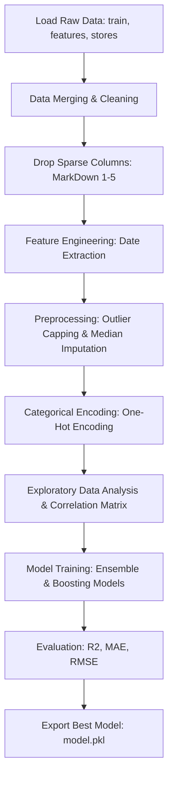
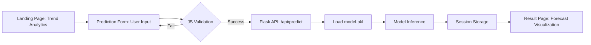
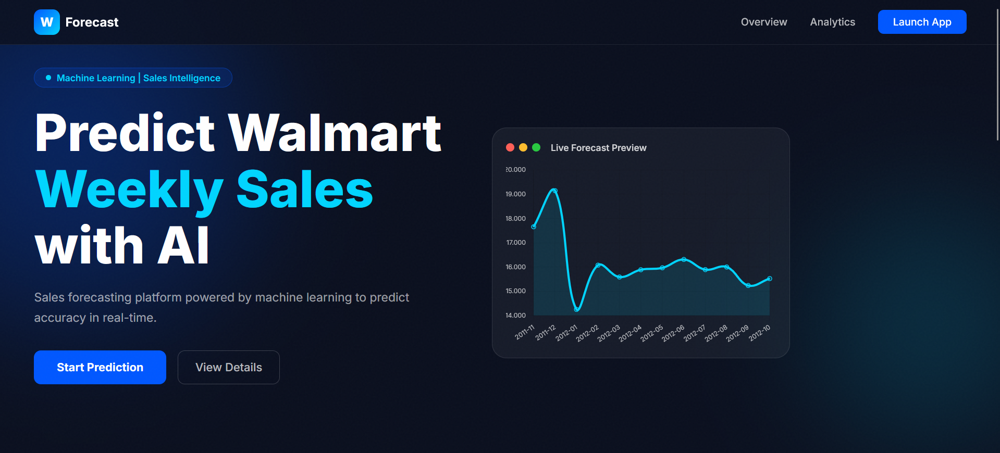
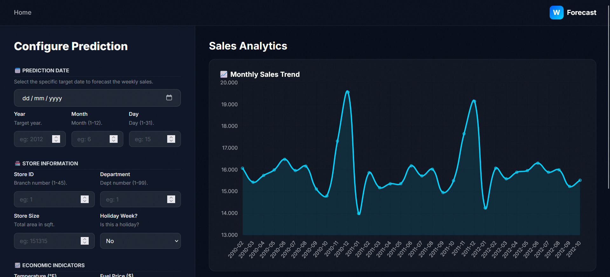
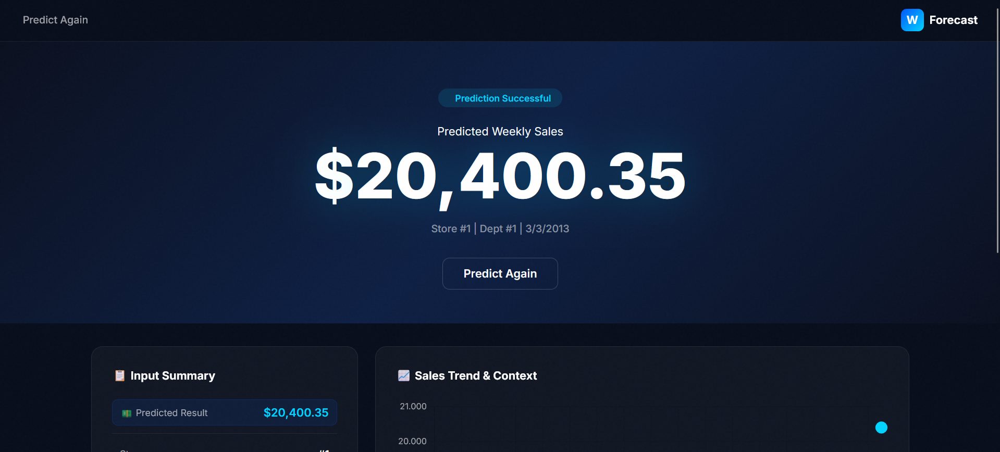
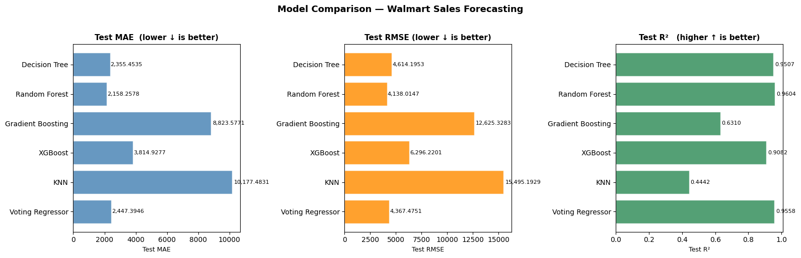

# Walmart Sales Forecasting: AI Sales Intelligence


An end-to-end Data Science and Machine Learning project designed to predict Walmart's weekly sales across different stores and departments. This repository demonstrates a complete machine learning pipeline, from data preprocessing and exploratory data analysis (EDA) to model deployment via a Flask web application.

---

## Project Architecture & Flows

### 1. Notebook Workflow (Data Science Pipeline)
The following flowchart illustrates the data processing and modeling steps conducted in `Walmart Sales Forecasting.ipynb`.



### 2. Web Application Workflow (Deployment)
The following flowchart illustrates how the user interacts with the Flask-based web interface.





## Methodology Highlights
### 1. Data Preprocessing & EDA
   - **Data Consolidation:** Merged multiple relational datasets (`train.csv`, `features.csv`, `stores.csv`) containing over 421,000 data points.
   - **Feature Engineering:** Extracted temporal features (`Year`, `Month`, `Day`) from datetime objects to capture seasonal retail trends.
   - **Data Cleaning:**
     - Handled missing values using median imputation.
     - Applied outlier capping (1st and 99th percentiles) to prevent extreme values from skewing the model.
   - **Categorical Encoding:** Converted categorical variables (like `IsHoliday` and `Type`) into numerical formats using Dummy Encoding (One-Hot).
   - **Correlation Analysis:** Generated correlation matrices to identify highly predictive features (e.g., Size, Store Type) vs. weakly correlated ones (e.g., 'Fuel Price').

### 2. Machine Learning Modeling
To capture the non-linear relationships in retail data, 6 different regression algorithms were trained and tested:
- **Tree-Based Models:** Decision Tree, Random Forest
- **Boosting Algorithms:** XGBoost, Gradient Boosting Machine (GBM)
- **Distance-Based:** K-Nearest Neighbors (KNN)
- **Ensemble Method:** **Voting Regressor** (Combining multiple strong learners for optimal variance-bias tradeoff).

### 3. Model Evaluation
Models were evaluated on a 30% holdout test set using regression metrics:
- **R² Score (Coefficient of Determination)**
- **MAE (Mean Absolute Error)**
- **RMSE (Root Mean Squared Error)**

      > Result: The Ensemble Voting Regressor outperformed individual models, achieving an impressive Test R² score of ~96%.



## Tech Stack
Analysis & Modeling: pandas, numpy, scikit-learn, xgboost
Visualization: matplotlib, seaborn, Chart.js (Frontend)[cite: 1]
Backend: Flask, joblib
Frontend: HTML, CSS, JavaScript 

## Project Structure
```
Walmart Forecast Sales/
├── data/  
├── models/                         
├── static/                         
│   ├── css/                        
│   └── js/                         
├── templates/                      
│   ├── landing.html
│   ├── predict.html
│   └── result.html
├── app.py                          
├── Walmart Sales Forecasting.ipynb 
└── README.md                      
```

## Disclaimer

This project is built for portfolio and learning purposes.

---

## Author

Yan Andhinaya Ardika
- GitHub: [yandik](https://github.com/yanardika)
---

